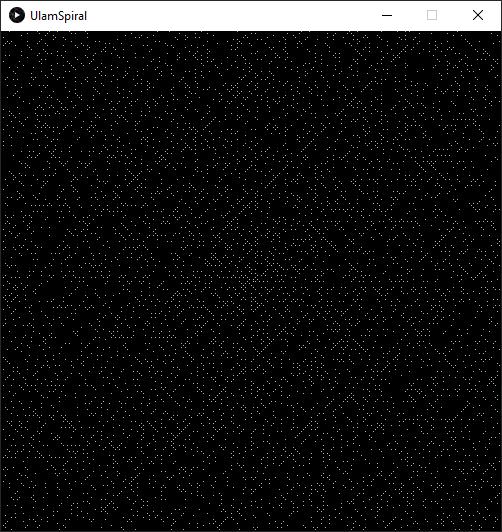
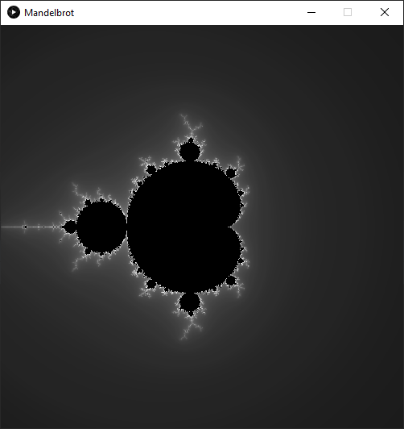
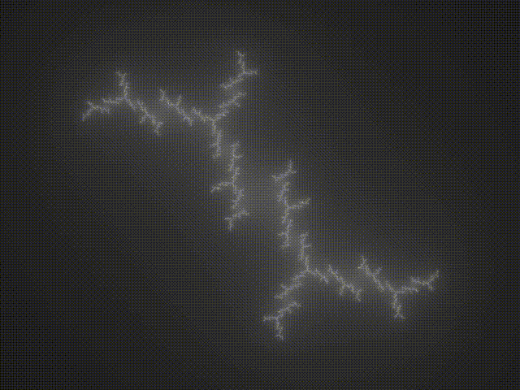
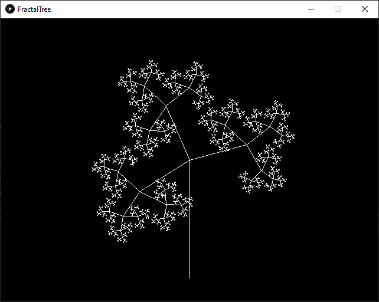
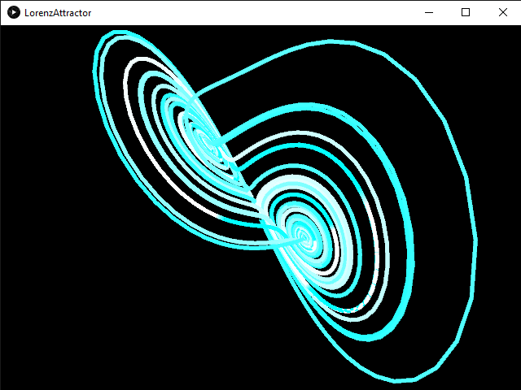
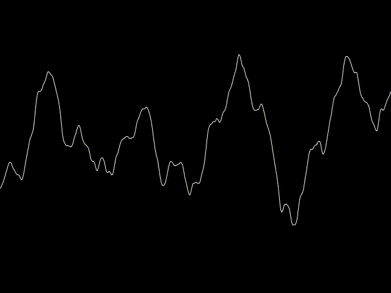
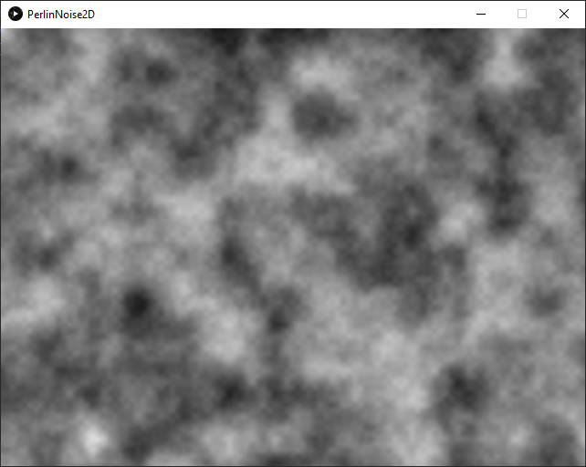
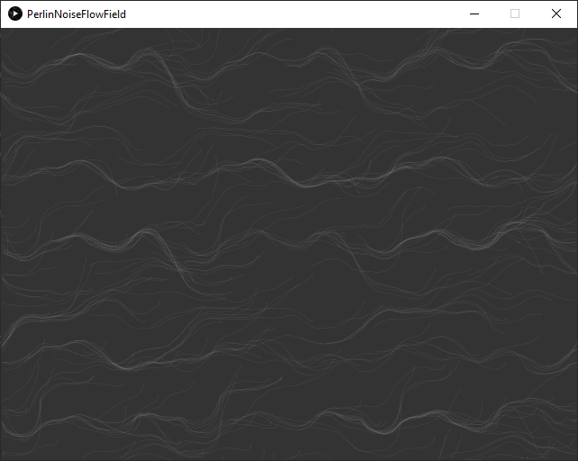

# Mathification

Hi. Ich möchte in dieser Repository einige verschiedene mathematische Sätze bzw. Erkenntnisse verdeutlichen.
Es ist eigentlich alles irgendwie grafisch darstellbar. Deswegen werde ich für dieses Projekt die Programmiersprache Kotlin (https://kotlinlang.org/) in Verbindung mit Processing (https://processing.org/) und folgenden weiteren Bibliotheken benutzen:
- https://github.com/alt3r3dgd/math

Hi. I would like to illustrate some different mathematical theorems or findings in this repository.
Actually, everything can be represented graphically in some way. That's why I will use the programming language Kotlin (https://kotlinlang.org/) in combination with Processing (https://processing.org/) and the following additional libraries for this project:
- https://github.com/alt3r3dgd/math

## Ulam-Spiral

Die Ulam-Spirale bzw. die Primzahlspirale ist eine interessante Entdeckung des polnischen Mathematikers *Stanislaw Ulam*. Die Erkenntnis welche erlangt werden konnte ist eine sehr komische Eigenschaft der Primzahlen. Die Primzahlen haben nämlich eine Tendenz in einer Spirale diagonale Linien zu bilden.

The Ulam spiral or the prime number spiral is an interesting discovery of the Polish mathematician *Stanislaw Ulam*. The discovery which could be obtained is a very strange property of prime numbers. The prime numbers have a tendency to form diagonal lines in a spiral.
 

## Mandelbrot
Die Mandelbrot-Menge bezeichnet die Menge aller komplexen Zahlen c, für welche die iterative Vorschrift $$k_{n+1}$ = $z_n^2$ + c$ mit dem Startwert $z_0 = 0$ eine Folge definiert, welche endlich bleibt. Ist die Mandelbrot-Menge als geometrische Figur betrachtet, so sieht man ein Fraktal. Die Mandelbrot-Menge wurde nach Benoît Mandelbrot benannt.

The Mandelbrot set denotes the set of all complex numbers c for which the iterative rule $$k_{n+1}$ = $z_n^2$ + c$ with initial value $z_0 = 0$ defines a sequence which remains finite. If the Mandelbrot set is considered as a geometric figure, one sees a fractal. The Mandelbrot set was named after Benoît Mandelbrot.

## Julia set
Die Julia-Mengen welche erstmals von Gaston Julia und Pierre Fatou beschrieben wurden, sind Teilmengen der komplexen Zahlenebene. 

The Julia sets which were first described by Gaston Julia and Pierre Fatou are subsets of the complex number plane. 

## Fractal Tree
Fraktale Bäume werden durch rekursive symmetrische Verzweigungen dargestellt. Sie bilden als Fraktale Objekte der Realität ab.

Fractal trees are represented by recursive symmetric branches. As fractals they represent objects of reality.

## Lorenz Attractor
Der Lorenz-Attraktor ist der Attraktor eines System von drei gekoppelten, nicht linearen Differenzialgleichungen. Formuliert wurde das System von Edward Lorenz ca. im Jahr 1963. Lorenz ging es um die Modellierung der Zustände in der Erdatmosphäre zum Zweck einer Langzeitvorhersage.

The Lorenz attractor is the attractor of a system of three coupled non-linear differential equations. The system was formulated by Edward Lorenz around 1963, who was interested in modeling the conditions in the Earth's atmosphere for the purpose of long-term prediction.

## Bubble Sort
Bubblesort ist ein Algorithmus der eine Liste von Elementen vergleichs basierend sortiert. Laufzeitkomplexität: $O($n^2)$

Bubblesort is an algorithm that sorts a list of elements based on comparison. Runtime complexity: $O($n^2)$

## Perlin Noise
Perlin Noise bezeichnet eine Rauschfunktion, welche auf der Basis von sogenannten pseudozufälligen Gradientenwerten an Gitterpunkten basiert. Das Prinzip geht auf Ken Perlin zurück.

Perlin Noise is a noise function based on so-called pseudorandom gradient values at grid points. The principle goes back to Ken Perlin.

Hier sieht man Perlin Noise durch das Überlagern von mehreren Frequenzen.

Here you can see fractal noise due to the superposition of several frequencies.

Ein häufiger Anwendungsfall für Perlin Noise ist die Erstellung eines Arts Strömungsfeld und eine gängige Methode um dies zu realisieren ist es den Rauschwert an einer bestimmten Position einen Winkel zuzuordnen.

A common use case for Perlin Noise is to create some kind of flow field, and a common way to do that is to map the noise value at a particular location to an angle.

